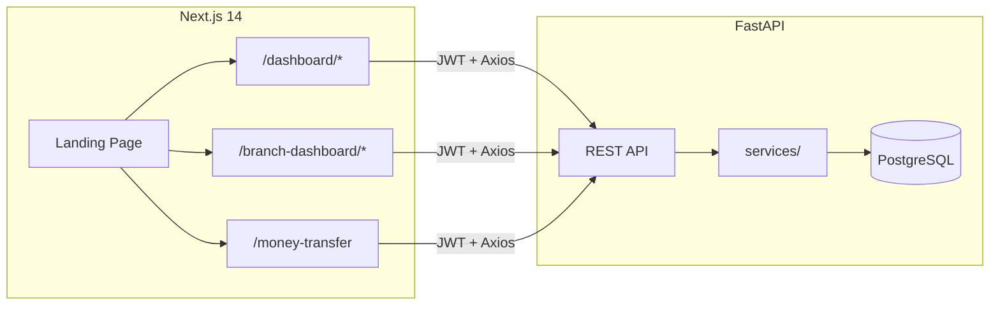

# Payment Transfer System

[](https://payment-transfer-system.vercel.app)
[](https://nextjs.org/)
[](https://fastapi.tiangolo.com/)
[](https://www.typescriptlang.org/)
[](https://www.postgresql.org/)

> **Portfolio Project** — Full-stack fintech platform for multi-branch money transfer management.  
> Built by **Ahmad Al-Halwany**.

---

## Project Status

| Use Case | Status |
|----------|--------|
| **Portfolio / Demo** | ✅ Ready — all dashboards and main routes are complete |
| **Production** | ⚠️ Requires API security review, E2E tests, and disabling `DEMO_MODE` |

**What's included:**
- Director dashboard (`/dashboard/*`) — branches, employees, transfers, reports, inventory, settings
- Branch manager dashboard (`/branch-dashboard/*`) — home, employees, reports, **profits**, **settings**
- Employee interface (`/money-transfer`) — send and receive transfers
- Arabic/English i18n, dark/light mode, role-specific sidebars
- Organized backend (`services/` + `routers/*_ops.py`) with pytest coverage
- CI via GitHub Actions + `npm test`

---

## Overview

A system for managing **inter-branch money transfers** in **SYP** and **USD**, with three user roles:

| Role | Description |
|------|-------------|
| **Director** | Manages all branches, employees, reports, inventory, and system settings |
| **Branch Manager** | Manages their branch: employees, reports, profits, and branch settings |
| **Employee** | Creates outgoing transfers and confirms incoming ones |



---

## Live Demo

| Role | Username | Password | Dashboard |
|------|----------|----------|-----------|
| Director | `director` | `demo123` | `/dashboard/director` |
| Branch Manager | `manager` | `demo123` | `/branch-dashboard` |
| Employee | `employee` | `demo123` | `/money-transfer` |

**Login page:** `/login` — or `/demo/login/` for one-click role-based login.

> **Demo data:** On deploy, set `AUTO_SEED_DEMO=true` and `DEMO_MODE=true`. The backend seeds **3 branches**, **6 users**, and **20 sample transfers** (IDs `DEMO-0001` … `DEMO-0020`) with mixed statuses, SYP/USD amounts, and dates spanning the last 30 days — so dashboards, reports, and profit pages look populated out of the box. Run `python seed.py` manually after the first deploy if needed.

---

## Features

### General
- **Multi-role RBAC** — role-based access via Middleware, RoleGuard, and API checks
- **i18n** — Arabic / English via `useLocale()` and `lib/i18n/locales/`
- **Dark / Light mode** — ThemeToggle in dashboard layouts
- **Guide panels** — management standards sidebar on key pages
- **Reports & charts** — Recharts with CSV export
- **PDF receipts** — jsPDF + html2canvas with Arabic amount-to-words
- **Real-time notifications** — Socket.io transfer alerts

### Director (`/dashboard`)

| Route | Description |
|-------|-------------|
| `/dashboard/director` | Overview — branch stats and balances |
| `/dashboard/branches` | Branch and fund management |
| `/dashboard/employees` | Employee management |
| `/dashboard/transactions` | Transfer management |
| `/dashboard/reports` | Full reporting suite |
| `/dashboard/inventory` | Inventory and tax tracking |
| `/dashboard/settings` | System settings and backup |

### Branch Manager (`/branch-dashboard`)

| Route | Description |
|-------|-------------|
| `/branch-dashboard` | Home — balances, transfers, stats |
| `/branch-dashboard/employees` | Branch employees |
| `/branch-dashboard/reports` | Branch reports (auto-scoped to branch) |
| `/branch-dashboard/profit` | Profit from completed outgoing transfers |
| `/branch-dashboard/settings` | Branch info and password change |

### Employee

| Route | Description |
|-------|-------------|
| `/money-transfer` | New transfer, outgoing, incoming, search |

### Legacy Redirects
Old `/director/*` routes are automatically redirected to `/dashboard/*` via `middleware.ts`.

---

## Tech Stack

| Layer | Technologies |
|-------|-------------|
| Frontend | Next.js 14, React 18, TypeScript, Tailwind CSS, Lucide Icons |
| Backend | FastAPI, SQLAlchemy, Pydantic, Alembic |
| Database | PostgreSQL |
| Auth | JWT (python-jose), bcrypt |
| Cache | Redis (optional) |
| Real-time | Socket.io |
| Charts | Recharts |
| PDF | jsPDF, html2canvas |
| Testing | Jest, pytest, Testing Library |
| CI | GitHub Actions |

---

## Project Structure

```
payment-system-portfolio/
├── app/                          # Next.js App Router
│   ├── page.tsx                  # Portfolio landing page
│   ├── case-study/               # Project case study
│   ├── (auth)/login/             # Login page
│   ├── dashboard/                # Director dashboard
│   │   ├── layout.tsx            # Sidebar + TopBar + RoleGuard
│   │   ├── director/             # Overview
│   │   ├── branches/             # Branches
│   │   ├── employees/            # Employees
│   │   ├── transactions/         # Transfers
│   │   ├── reports/              # Reports
│   │   ├── inventory/            # Inventory
│   │   └── settings/             # Settings
│   ├── branch-dashboard/         # Branch manager dashboard
│   │   ├── layout.tsx            # BranchManagerSidebar + TopBar
│   │   ├── page.tsx              # Home
│   │   ├── employees/
│   │   ├── reports/
│   │   ├── profit/
│   │   └── settings/
│   ├── money-transfer/           # Employee interface
│   ├── api/                      # Axios API clients
│   └── hooks/                    # useAuth, useTransactions, ...
│
├── components/
│   ├── auth/RoleGuard.tsx        # Route protection by role
│   ├── branch-manager/           # Guide panels + branch manager UI
│   ├── dashboard/                # TopBar, Sidebar
│   ├── shared/                   # Header, Sidebars, Modals
│   └── providers/LocaleProvider  # i18n context
│
├── lib/
│   ├── i18n/                     # ar.ts, en.ts, getTranslations
│   ├── route-access.ts           # Role-based route rules
│   ├── site-config.ts            # Portfolio and demo config
│   └── dashboard-utils.ts        # UI helpers
│
├── middleware.ts                 # JWT cookie + RBAC + legacy redirects
│
├── backend/
│   ├── main.py                   # Entry point → server_improved.py
│   ├── server_improved.py        # FastAPI app + legacy routes
│   ├── routers/                  # *_ops.py — organized endpoints
│   │   ├── auth.py
│   │   ├── demo.py
│   │   ├── branch_manager_ops.py
│   │   ├── branch_employees_ops.py
│   │   ├── branch_profits_ops.py
│   │   ├── reports_ops.py
│   │   ├── transactions_ops.py
│   │   ├── inventory_ops.py
│   │   └── settings_ops.py
│   ├── services/                 # Business logic
│   ├── models.py                 # SQLAlchemy models
│   ├── schemas/                  # Pydantic schemas
│   ├── tests/                    # pytest (17+ test files)
│   └── seed.py                   # Demo seed data
│
├── .github/workflows/ci.yml      # lint + jest + pytest
├── jest.config.js
└── vercel.json                   # Frontend deployment config
```

---

## Quick Start

### Prerequisites

- Node.js 18+
- Python 3.10+
- PostgreSQL 15+ (or Docker)

### 1. Backend

```bash
cd backend
python -m venv venv

# Windows
venv\Scripts\activate

# macOS / Linux
source venv/bin/activate

pip install -r requirements.txt
cp .env.example .env
# Edit DATABASE_URL and SECRET_KEY in .env

python seed.py
uvicorn main:app --reload --port 8000
```

**API:** [http://localhost:8000](http://localhost:8000)  
**Swagger Docs:** [http://localhost:8000/docs](http://localhost:8000/docs)  
**Health check:** `GET /health`

#### Docker (API + PostgreSQL + Redis)

```bash
docker compose up --build
```

#### Migrations (Alembic)

```bash
cd backend
alembic upgrade head
```

### 2. Frontend

```bash
npm install
cp .env.example .env.local
# Set NEXT_PUBLIC_API_URL=http://localhost:8000

npm run dev
```

**Frontend:** [http://localhost:3000](http://localhost:3000)

---

## Environment Variables

### Frontend (`.env.local`)

| Variable | Description |
|----------|-------------|
| `NEXT_PUBLIC_API_URL` | Backend API base URL |
| `JWT_SECRET` | (Optional) for Next.js auth routes |

### Backend (`backend/.env`)

| Variable | Description |
|----------|-------------|
| `DATABASE_URL` | PostgreSQL connection string |
| `SECRET_KEY` | JWT secret — **change in production** |
| `CORS_ORIGINS` | Allowed frontend URLs |
| `AUTO_SEED_DEMO` | Auto-create demo accounts on startup |
| `DEMO_MODE` | Enable `/demo/login/` — **disable in production** |
| `REDIS_URL` | (Optional) Redis cache URL |

---

## Auth & RBAC

```
Login → JWT token (cookie + localStorage)
         ↓
middleware.ts → validates token + userRole cookie
         ↓
RoleGuard.tsx → blocks unauthorized access in layouts
         ↓
FastAPI get_current_user → validates JWT + role + branch_id
```

| Route | Allowed Roles |
|-------|---------------|
| `/dashboard/*` | `director` |
| `/branch-dashboard/*` | `branch_manager` |
| `/money-transfer` | All authenticated users |

---

## Key API Endpoints

| Endpoint | Role | Description |
|----------|------|-------------|
| `POST /login/` | Public | User login |
| `POST /demo/login/` | Demo | One-click login by role |
| `GET /branch-manager/dashboard/` | manager | Branch manager dashboard |
| `GET /branch-manager/employees/` | manager | Branch employees |
| `GET /branch-manager/profits/` | manager | Branch profits |
| `GET /reports/*` | director/manager | Reports (manager is branch-scoped) |
| `GET /inventory/summary/` | director | Inventory summary |
| `GET/PUT /settings/system/` | director | System settings |
| `POST /change-password/` | authenticated | Change password |
| `PUT /transactions/{id}/` | role-based | Update transfer |
| `POST /money-transfer/preview/` | employee+ | Transfer preview |

> Full API documentation: `http://localhost:8000/docs`

---

## Internationalization (i18n)

The app supports **Arabic** and **English** with RTL/LTR layout switching.

- Translation files: `lib/i18n/locales/ar.ts` and `en.ts`
- Usage in components: `const { t, locale } = useLocale()`
- Branch manager keys: `t.dashboard.manager.*`
- Director keys: `t.dashboard.*`
- Language switch: `LanguageToggle` in TopBar / Header

---

## Testing

### Frontend

```bash
npm test
```

Includes: `Header.test.tsx`, `route-access.test.ts`

### Backend

```bash
cd backend
pytest tests -v
```

| Test Suite | Coverage |
|------------|----------|
| `test_auth.py` | Authentication |
| `test_branch_manager.py` | Branch manager dashboard |
| `test_branch_employees.py` | Branch employees |
| `test_branch_profits.py` | Branch profits |
| `test_reports.py` | Reports |
| `test_transactions.py` | Transfers |
| `test_inventory.py` | Inventory |
| `test_settings.py` | Settings |

### CI

GitHub Actions (`.github/workflows/ci.yml`):
- **frontend:** `npm ci` → `lint` → `test`
- **backend:** `pytest -q`

---

## Deployment

### Frontend → Vercel

1. Connect the repo to [Vercel](https://vercel.com)
2. Set `NEXT_PUBLIC_API_URL` to your backend URL
3. Deploy (auto-detected via `vercel.json`)

### Backend → Railway / Render

1. Copy variables from `backend/.env.example`
2. Set `ENVIRONMENT=production` and a strong `SECRET_KEY`
3. Set `DEMO_MODE=false`
4. Start command: `uvicorn main:app --host 0.0.0.0 --port $PORT`
5. Run `python seed.py` once (for demo data)

### Database → Neon / Supabase

A free PostgreSQL tier works well for portfolio demos.

---

## Development Patterns

### Backend — adding a new feature

```
backend/services/<feature>.py       ← business logic
backend/routers/<feature>_ops.py    ← FastAPI router
server_improved.py                  ← app.include_router(...)
backend/tests/test_<feature>.py     ← pytest
```

### Frontend — adding a new page

```
app/api/<feature>.ts                ← Axios client
app/<section>/<page>/page.tsx       ← UI (Tailwind + Lucide)
components/<section>/*GuidePanel    ← management standards panel
lib/i18n/locales/ar.ts + en.ts      ← translation keys
```

---

## Suggested Demo Flow

A quick walkthrough for reviewers:

1. Open `/login` → sign in as `director` → explore `/dashboard/director`
2. Visit `/dashboard/branches` and `/dashboard/reports`
3. Log out → sign in as `manager` → open `/branch-dashboard`
4. Try `/branch-dashboard/profit` and `/branch-dashboard/settings`
5. Log out → sign in as `employee` → go to `/money-transfer` → create a transfer

---

## Author

**Ahmad Al-Halwany**

- GitHub: [ahmad-alhalwany](https://github.com/ahmad-alhalwany)
- Project: [payment-transfer-system](https://github.com/ahmad-alhalwany/payment-transfer-system)

---

## License

MIT License — free for learning and portfolio use.
